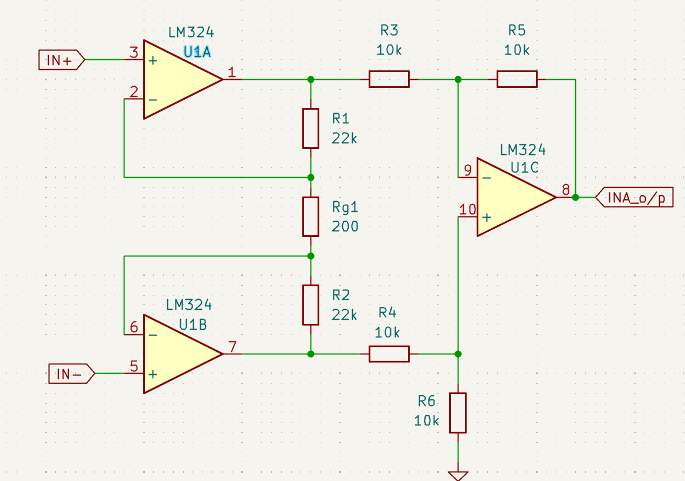
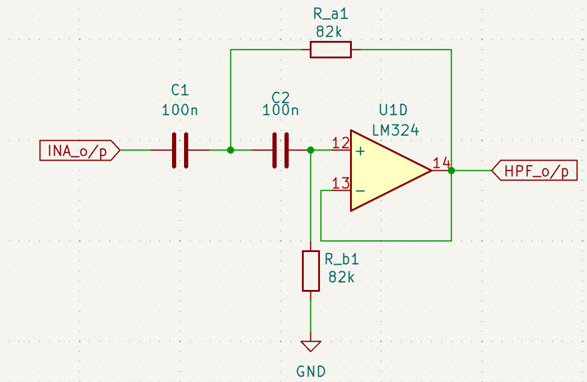
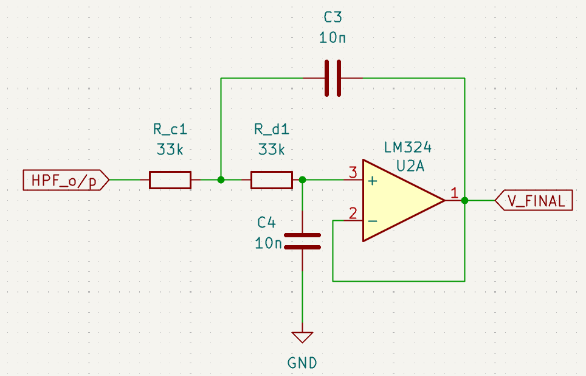
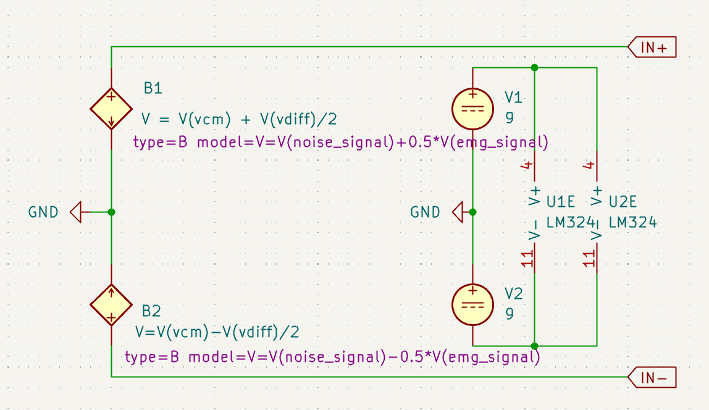
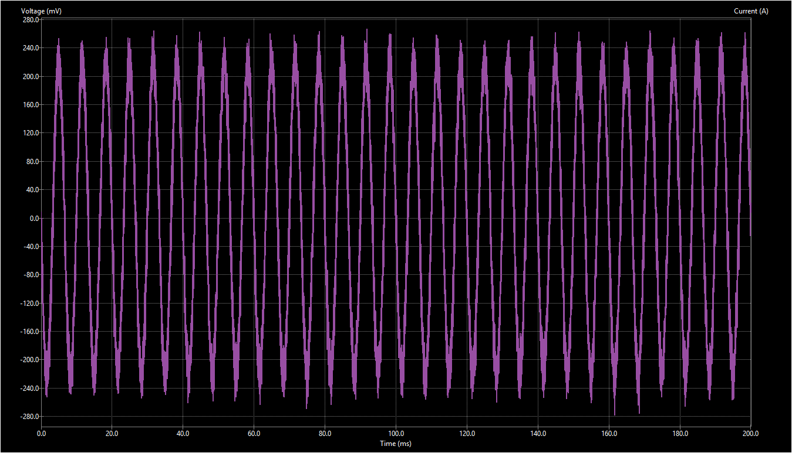

# EMG Signal Amplifier

This project demonstrates the design and simulation of an EMG (Electromyography) signal amplifier capable of extracting weak muscle signals buried under electrical noise. The system amplifies micro-volt EMG signals while removing low-frequency motion artifacts and high-frequency interference.

---

## 📌 Project Overview

Surface EMG signals are extremely weak (~1 mV) and easily corrupted by 50/60 Hz mains noise.  
This project implements a **three-stage analog front-end**:

1. **Instrumentation Amplifier (INA)** – High gain + high CMRR  
2. **High-Pass Filter (HPF)** – Removes motion artifacts  
3. **Low-Pass Filter (LPF)** – Removes high-frequency noise  

The final output is a clean EMG waveform ready for visualization or ADC sampling.

---

## 🔧 Features

- Total amplification ≈ 221×  
- High common-mode rejection (CMRR)  
- EMG bandwidth filtering (≈ 20 Hz – 480 Hz)  
- 2nd-order HPF + LPF using Sallen-Key topology  
- Realistic EMG + noise simulation  
- Implemented using KiCad + NgSpice  

---

## 📂 Circuit Design

### **Full Circuit**

### **Instrumentation Amplifier (INA)**

### **High-Pass Filter**

### **Low-Pass Filter**

### **Input Signal Mixer**

### **Power Supply**

---

## 📊 Waveform Results

### **Raw EMG Signal**

### **Input with Added Noise**

### **Output of Instrumentation Amplifier**

### **Final Filtered Output**

---

## 🧪 Test Signal Modeling

- **EMG Source:** 1 mV 150 Hz sine burst  
- **Noise Source:** 1 V 50 Hz mains + white noise  
- Combined and fed into INA differential inputs  
- Simulated using behavioral voltage sources in KiCad/NgSpice  
